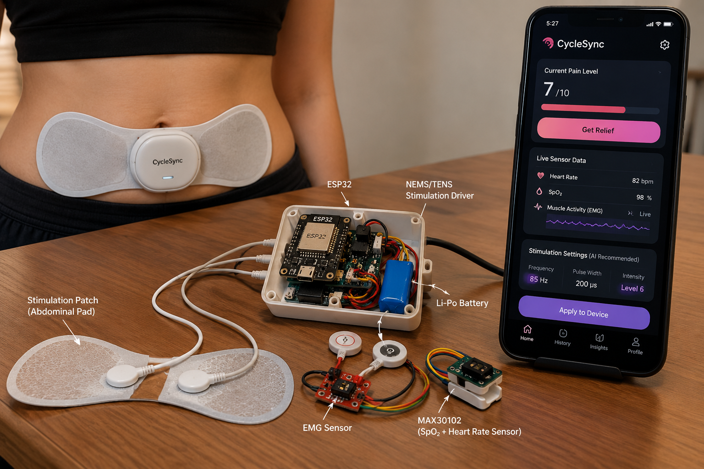
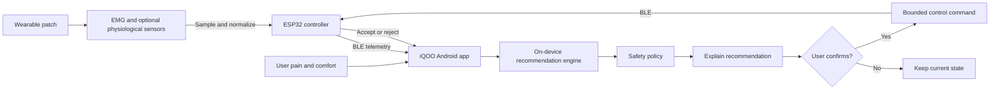
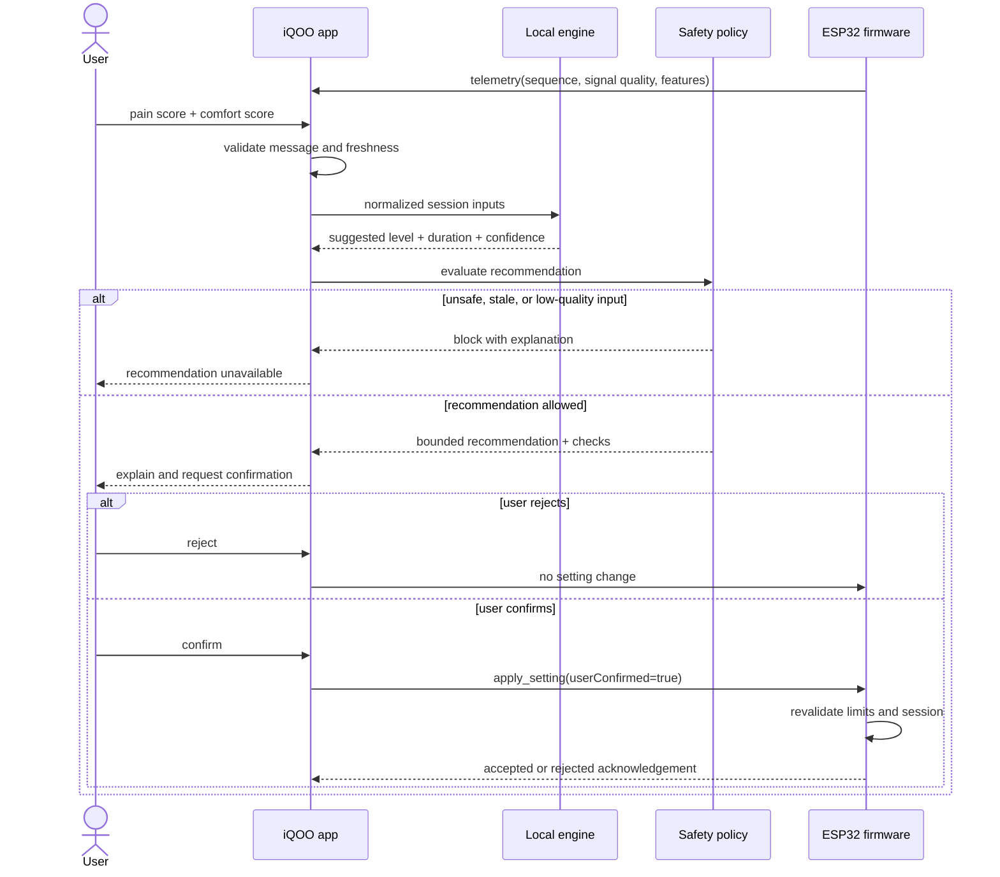
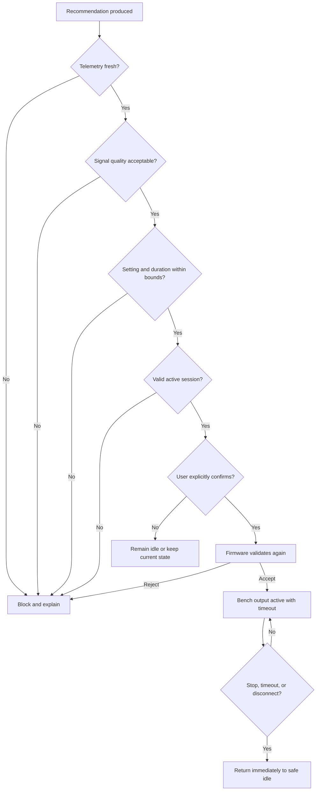
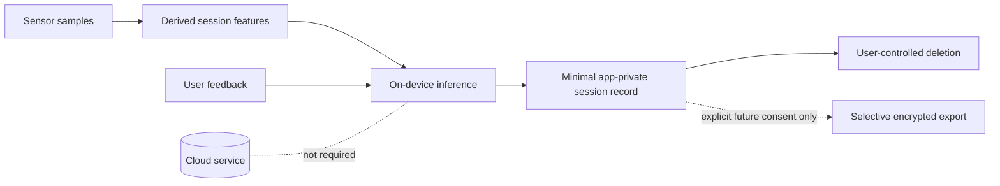

# CycleSync

<p align="center">
  
</p>

<p align="center">
  <strong>Adaptive period-pain support, powered on-device.</strong><br />
  Wearable sensing + ESP32 control + private mobile AI on an iQOO phone.
</p>

<p align="center">
  <a href="https://github.com/vinodyallur/cyclesync/actions/workflows/ci.yml"></a>
  
  
  
</p>

CycleSync is a privacy-first wearable period-pain support prototype. It combines
an ESP32-based sensor and stimulation controller with an Android application that
runs recommendation logic locally on an iQOO phone. User feedback and optional
physiological features inform a bounded suggestion; safety policy and explicit
user approval remain between every recommendation and hardware command.

> [!CAUTION]
> **CycleSync is an early-stage engineering demonstration, not a medical device.**
> It does not diagnose or treat a condition and is not ready for unsupervised
> human use. Keep physical stimulation output disabled until the system has
> undergone qualified electrical-safety, clinical, and regulatory review.

The image above is a product visualization for the prototype concept. It is not
evidence of clinical validation or approval for human use.

## The opportunity

Many relief devices provide fixed intensity controls and require the user to
repeatedly guess what feels appropriate. CycleSync investigates whether a phone
can privately combine user feedback, session history, and optional sensor
features to recommend a suitable setting within predefined limits.

| Today | CycleSync prototype |
| --- | --- |
| Fixed intensity levels | Context-aware, bounded recommendation |
| Repeated manual adjustment | Pain and comfort feedback included |
| Limited explanation | Recommendation reason and checks are visible |
| Cloud-dependent personalization | On-device inference on the iQOO phone |
| Single software control point | Independent app and firmware safety gates |
| Unclear data handling | Local-first storage and explicit export |

## Product flow



## End-to-end session

| Step | What happens | Where it runs |
| ---: | --- | --- |
| 1 | The user starts a local session and records pain and comfort. | Android app |
| 2 | The ESP32 publishes signal quality and normalized sensor features. | Firmware + BLE |
| 3 | The app validates schema, sequence, freshness, and signal quality. | Android app |
| 4 | The local engine generates a setting, duration, confidence, and reason. | iQOO phone |
| 5 | Safety policy checks limits, session state, and data quality. | iQOO phone |
| 6 | The user reviews the explanation and explicitly confirms or rejects. | Android app |
| 7 | Firmware independently validates any confirmed command. | ESP32 |
| 8 | The device acknowledges, rejects, times out, or immediately stops. | ESP32 + app |
| 9 | A minimal session record remains in app-private local storage. | iQOO phone |

## Control sequence



## Safety flow



## Privacy flow



## Repository layout

```text
cyclesync/
├── mobile/             Android/Kotlin application
├── firmware/           ESP32 PlatformIO firmware
├── protocol/           Shared BLE JSON schema and examples
├── models/             Model card, feature contract, and training scaffold
├── hardware/           BOM, pin map, and hardware integration notes
├── docs/               Architecture, safety, privacy, and demo documentation
├── tools/              Validation and developer scripts
└── .github/workflows/  Automated checks
```

## Core principles

- **Local first:** inference and session history stay on the phone by default.
- **Recommendation only:** software proposes settings; it does not autonomously
  escalate stimulation.
- **User in the loop:** applying a recommendation requires explicit confirmation.
- **Bounded control:** app and firmware independently enforce allowed settings,
  timeouts, and emergency stop behavior.
- **Fail closed:** missing, stale, or low-quality sensor data disables adaptive
  recommendations instead of guessing.
- **No medical claims:** effectiveness requires formal safety validation and
  clinical evaluation beyond this prototype.

## System components

### Android application

- BLE discovery, connection health, and message sequencing.
- Pain and comfort input with local session history.
- Deterministic baseline recommendation engine behind a model-ready interface.
- Safety explanation and explicit confirm/reject interaction.
- Emergency stop and simulated transport for reliable demos.

### ESP32 firmware

- Sensor sampling and normalized telemetry.
- Versioned BLE JSON transport.
- Independent setting, duration, timeout, and replay checks.
- Emergency-stop priority and fail-closed disconnect behavior.
- Bench mode with physical stimulation output disabled by default.

### Model layer

- Stable feature contract shared with the Android app.
- Synthetic-data training scaffold and model card.
- TFLite-compatible export target for later on-device integration.
- No model binary or health dataset committed to Git.

### Hardware package

- ESP32-S3 controller and sensor-only prototype path.
- EMG feature input and optional compatible HR/SpO₂ sensing.
- BOM, pin map, block diagram, and enclosure constraints.
- Future stimulation stage isolated behind a documented safety interlock.

## Quick start

### Validate the shared protocol

```powershell
python -m pip install -r tools/requirements.txt
python tools/validate_protocol.py protocol/examples
python -m unittest discover -s tools/tests -v
```

### Android app

Open `mobile/` in Android Studio, or run:

```powershell
cd mobile
.\gradlew.bat test
.\gradlew.bat assembleDebug
```

### ESP32 firmware

Install PlatformIO, connect a supported ESP32-S3 development board, then run:

```powershell
cd firmware
pio test -e native
pio run -e esp32-s3-devkitc-1
```

Hardware output is disabled by default. See `docs/SAFETY.md` and
`hardware/README.md` before connecting any stimulation-stage hardware.

## Hackathon demo scope

The demonstration covers the complete data path:

1. ESP32 publishes live or simulated sensor telemetry over BLE.
2. The Android app records pain and comfort feedback.
3. A local recommendation engine proposes a bounded setting.
4. The safety policy explains whether the recommendation is allowed.
5. The user confirms or rejects the recommendation.
6. The controller acknowledges the approved command or emergency stop.

See `docs/DEMO.md` for the presentation flow and fallback modes.

## Current implementation status

| Area | Status | Notes |
| --- | --- | --- |
| Shared BLE protocol | Implemented | Schema, examples, and validation tests |
| Android session domain | Implemented | Recommendation and safety interfaces |
| Android BLE transport | Prototype | Real and simulated transport boundary |
| ESP32 protocol handling | Prototype | Telemetry, apply, stop, and acknowledgement |
| Firmware safety controller | Implemented | Bounds, timeout, replay, and emergency stop |
| Sensor integration | Scaffolded | Synthetic data first; bench drivers next |
| On-device ML | Scaffolded | Deterministic baseline before TFLite model |
| Physical stimulation output | Disabled | Requires independent qualified review |

## Documentation map

- `docs/ARCHITECTURE.md` — components, trust boundaries, and data ownership.
- `docs/SAFETY.md` — mandatory controls and unsupported human-use mode.
- `docs/HARDWARE.md` — safe integration order and hardware blocks.
- `docs/PROTOCOL.md` — message envelope and command lifecycle.
- `docs/PRIVACY.md` — local-first storage and future sharing rules.
- `docs/DEMO.md` — primary presentation flow and fallback modes.

## Team

- **Vinod** (`@vinodyallur`) — co-author and engineering lead.
- **Srushti RM** (`srushtirm`) — co-author and product collaborator.

## Contributing and security

Read `CONTRIBUTING.md` before opening a pull request. Report security or privacy
issues privately using GitHub's security-advisory flow; see `SECURITY.md`.
