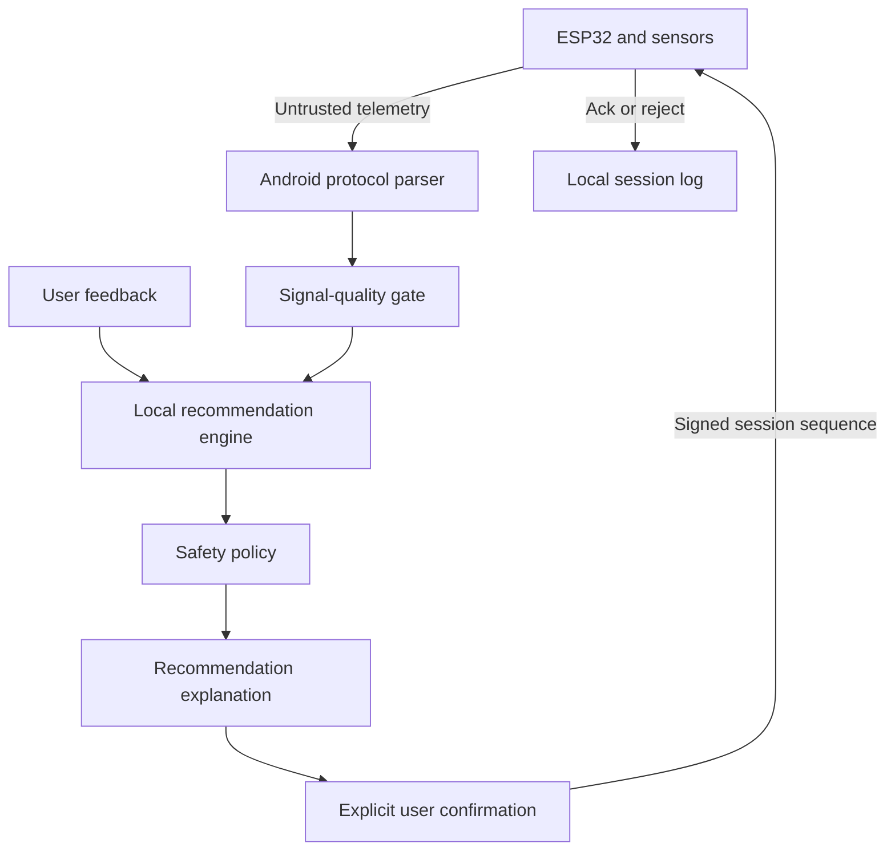

# Architecture

CycleSync separates sensing, recommendation, policy, and actuation so no single
model output can directly control hardware.

## Components

### Wearable and ESP32 firmware

- Samples EMG-derived features and optional compatible sensor data.
- Publishes normalized telemetry through a versioned BLE message contract.
- Accepts only user-confirmed commands that pass firmware-side limits.
- Provides acknowledgement, timeout, disconnect, and emergency-stop behavior.
- Starts with physical stimulation output disabled for bench demonstrations.

### Android application

- Owns BLE discovery, connection state, and protocol translation.
- Collects user-entered pain and comfort scores.
- Runs the recommendation engine locally.
- Applies an independent safety policy before showing a suggestion.
- Requires explicit user confirmation before sending an apply command.
- Stores session data locally and supports explicit deletion.

### Recommendation layer

The first implementation is a deterministic, testable baseline with the same
interface planned for a future on-device model. This lets the team validate the
sensor-to-phone-to-controller workflow before claiming model performance.

Inputs include pain score, comfort score, signal quality, previous accepted
setting, and optional physiological features. Output is a suggested setting,
duration, confidence, explanation, and a list of passed safety checks.

### Shared protocol

`protocol/cyclesync.schema.json` is the source of truth for telemetry,
recommendation, control-command, and acknowledgement messages. Android and
firmware implementations mirror these definitions and share checked examples.

## Trust boundaries

Malformed or stale messages are rejected at the parser. Low-quality telemetry
cannot enable adaptive recommendations. Model output is untrusted until policy
validation and user confirmation both succeed.
