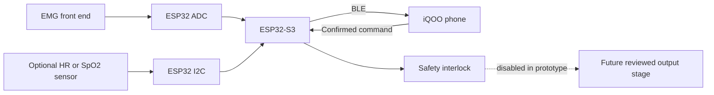

# Hardware integration overview

The prototype separates low-voltage sensing and communication from any future
stimulation stage. Development should begin with simulated telemetry, then a
sensor-only bench build, and only later a professionally reviewed output stage.

## Functional blocks

## Repository hardware files

- `hardware/bom.csv`: prototype parts and safety classification.
- `hardware/pinout.h`: single firmware pin map.
- `hardware/block-diagram.mmd`: editable system block diagram.
- `hardware/enclosure/README.md`: mechanical constraints and image placeholders.

No stimulation waveform, current, voltage, or electrode-placement parameters are
provided because those require qualified engineering and clinical review.
